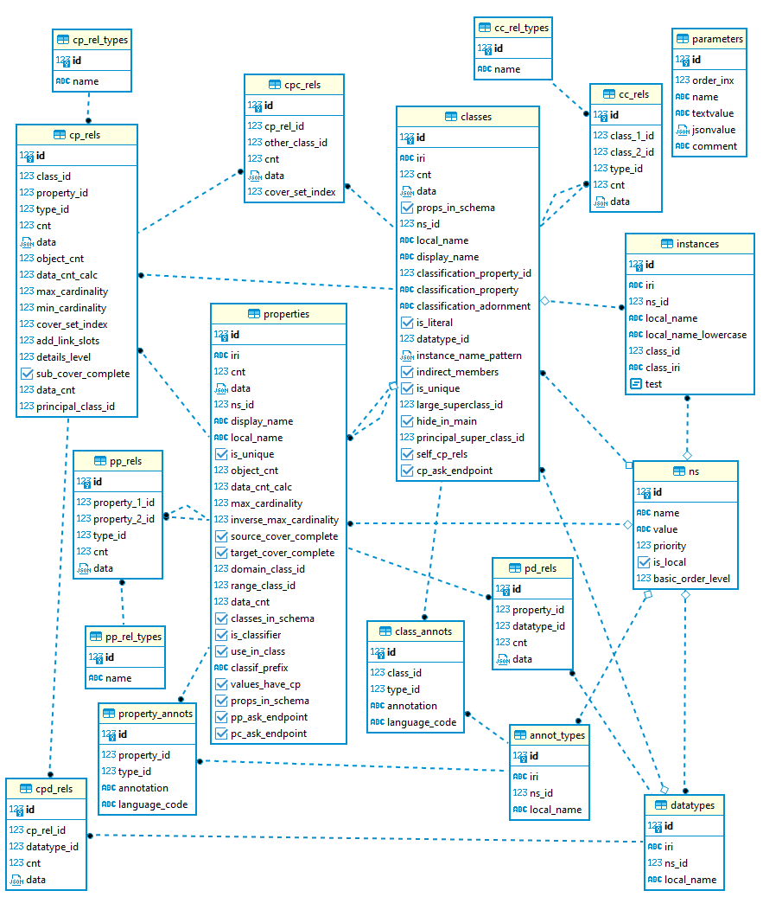
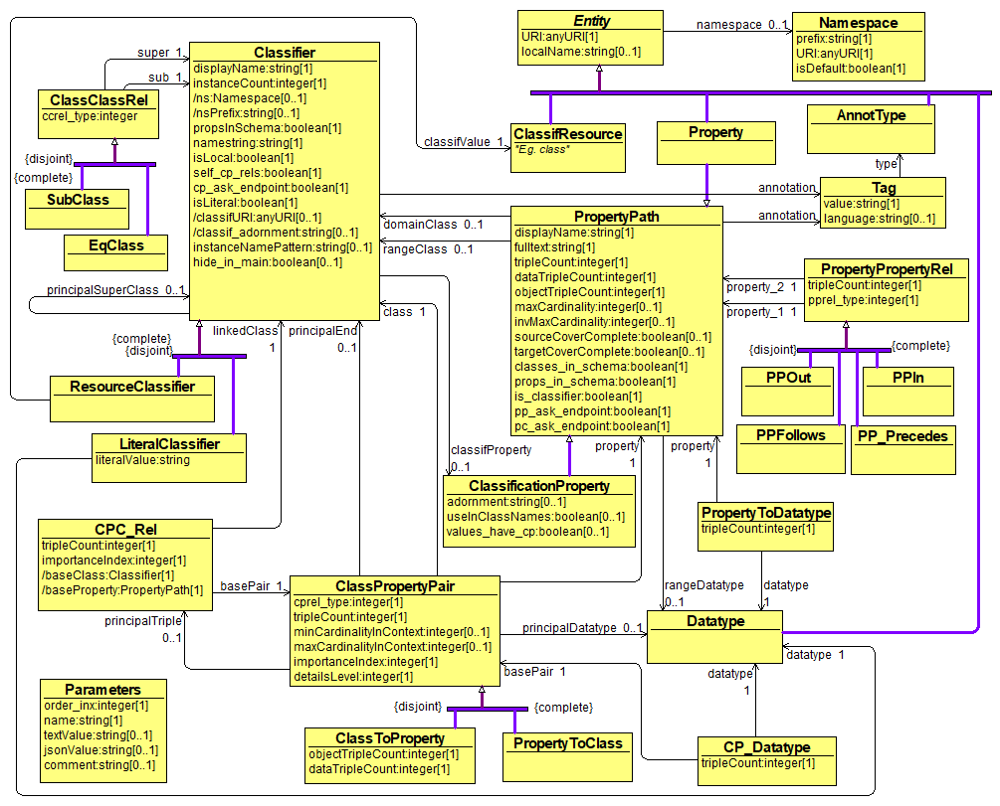
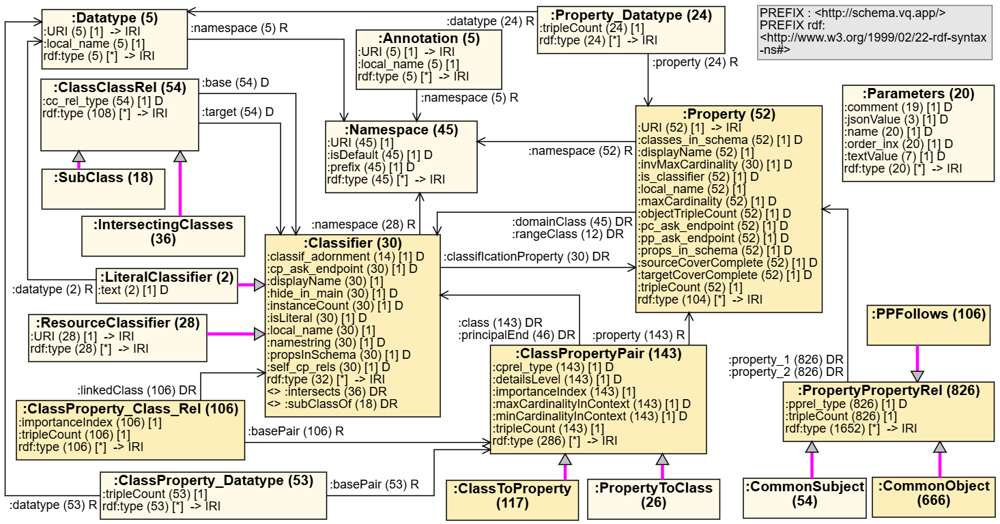

# Visual Tool Data Schema KG Generation

[](LICENSE)
[](https://www.python.org/downloads/)

## Table of Contents

- [Project Overview](#project-overview)
- [Installation](#installation)
- [Usage](#usage)

## Acknowledgement

The software module has been created at Institute of Mathematics and Computer Science, University of Latvia, https://lumii.lv, 
with support from Latvian Science Council grant lzp-2021/1-0389 "Visual Queries in Distributed Knowledge Graphs" (2022-2024).

## Project Overview

This python script allows generating RDF triples from a SQL database by using 
simple user-provided mappings (in form of custom-structured .csv files).

In this specific case, the script is used to generate RDF triples 
from a database containing SPARQL endpoint schema descriptions, as used in the ViziQuer tool.

This repository also shows the mappings that are used for 
generating the triples for the above mentioned task.

The technical data schema definition can be obtained from the schema databases themselves (the database scripts
located at `../../init/db/pg`)

The following is a simplified illustrative structure of a version of the considered data schema.


The conceptual target data ontology is illustrated by the following diagram. 


The technical RDF class and property structure is created by the mapping definitions themselves. The following
diagram illustrated the knowledge graph schema obtained for the Nobel Prizes data structure 
(the schema shows the general class and property structure, accompanied with the statistics from the Nobel Prizes data set).




## Installation

### Prerequisites

- Python 3.8 or higher
- [Optional dependencies, e.g., `pip`]
- Postgres DBMS. Steps to install stand-alone Postgres DBMS are described [here](https://www.postgresql.org/). If you want to experiment with schemas and databases provided in this repo you can start the provided containers and connect to a postgres running inside these containers.


### Installation Steps

1. Import database with schema descriptions to Postgres. In this repo we provide sql file [rdfmeta_demo.sql](./rdfmeta_demo.sql) with multiple schema descriptions. To import this file one needs to:
    - create an empty database named name
    - and restore the provided dump of db, containing schema descriptions to this newly created db. The restore can be done by running the following command from console:

    ```bash
    ./psql -U postgres -h localhost -p 5433 -d rdf -f rdfmeta_demo.sql
    ```
    where postgres is user name, 5433 is db port and rdf is the name of the newly created database.


2. Install the required packages:

    ```bash
    pip install -r requirements.txt
    ```
3. Create .env file. This file must contain values for the following variables : 
- DB_URL
- DB_SCHEMA
- RDF_SCHEMA_NS
- CLASS_MAPPINGS
- LINK_MAPPINGS
- OUTPUT_FILE
- RDF_FILES
- CSV_FILE_DELIMITER

If you are not sure how to set these values - you can take a look at the file [sample.env](./sample.env) it is prepopulated with sample values for environment variables. 

Sample.env is created just for illustration purposes. Values used during program execution are taken from .env file. 

<!--
4. Set appropriate values for the following constants in python code (top part of the main.py file):
- DB_SCHEMA_NAME
- HOST
- TRG_DIR_FOR_RDF_FILES
- FPATH_TO_CLASS_MAPPINGS
- FPATH_TO_LINK_MAPPINGS
- RDF_SCHEMA_NS
-->

## Usage

To run the project, execute the following command:

```bash
python ./main.py
```

During its execution, this program takes user-supplied mappings and on the  basis of the information found in these mappings, generates RDF triples. 

These mappings are written into .xls files: one file for [class and attribute mappings ](./Mappings.xlsx), and the other for [link mappings](./Mappings_links.xlsx). Before passing these mapping files to the .py script, they need to be saved as .csv files. Examples of these 
[.csv files](./Mappings.csv) can also be found in this repository.

If the program completes successfully, an .nt file containing generated RDF triples should appear in the filepath provided in variable OUTPUT_FILE. For instance, see [generated.nt](./generated.nt).

This file can then be uploaded to any RDF data store that supports .ntriple serialization format (e.g. [OpenLink Virtuoso](https://virtuoso.openlinksw.com/) or Apache Jena).